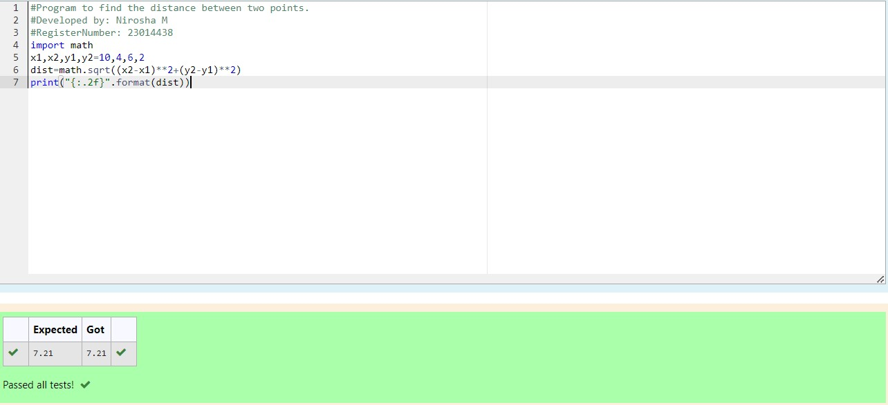

# DISTANCE-BETWEEN-TWO-POINTS

## AIM:
To write a python program to find the distance two 2 points
## ALGORITHM:
### Step 1: 
### Step 2: 
### Step 3: 
Substitute the values in the distance formula  
### Step 4: 
### Step 5: 
### PROGRAM:
  ```
  #Program to find the distance between two points.
#Developed by: Nirosha M
#RegisterNumber: 23014438
import math
x1,x2,y1,y2=10,4,6,2
dist=math.sqrt((x2-x1)**2+(y2-y1)**2)
print("{:.2f}".format(dist))
  ```


### OUTPUT:


### RESULT:
thus the DISTANCE-BETWEEN-TWO-POINTS are ececuted successfully